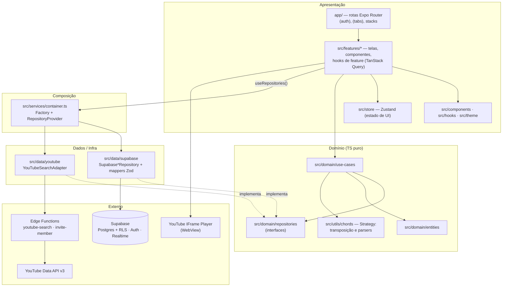
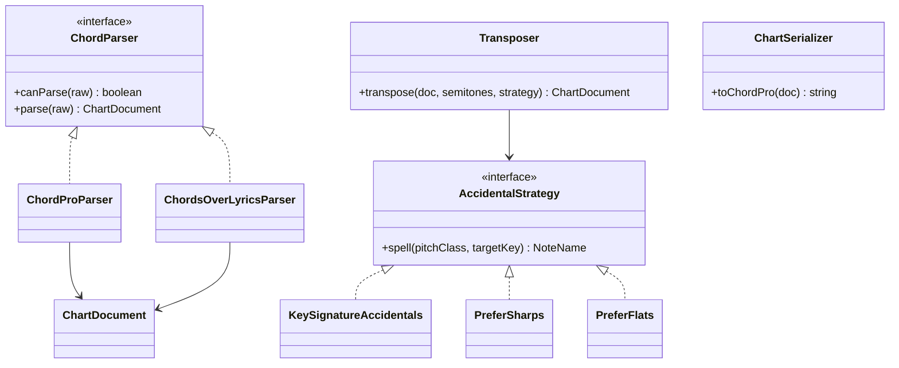
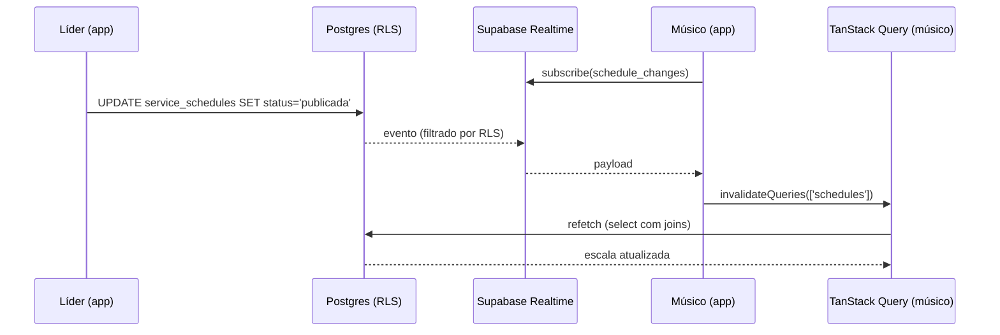
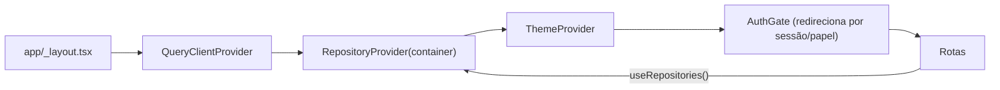
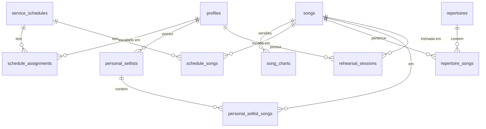

# Uníssono — Arquitetura

> Status: **rascunho para aprovação (Fase 0)** · Decisões pendentes referenciadas como DP-xx em [`product-plan.md`](./product-plan.md#8-decisões-pendentes-bloqueiam-a-fase-1).
> Os trechos TypeScript abaixo são **contratos de design**, não implementação.

## 1. Visão geral

- **Cliente:** Expo (React Native) + TypeScript `strict`, Expo Router (DP-01), NativeWind (DP-02).
- **Backend:** Supabase — Postgres com RLS, Auth, Realtime e Edge Functions (apenas para o que não pode rodar no cliente com segurança: busca YouTube e convite de membros).
- **Estilo arquitetural:** Clean Architecture em camadas + organização _feature-first_ na apresentação.

### 1.1 Princípios

1. **Regra de dependência:** dependências apontam sempre para dentro (`domain`). `domain` não conhece React, Expo, Supabase nem YouTube.
2. **Banco é a última barreira:** toda regra de acesso existe em RLS; a guarda de rota no app é conveniência de UX.
3. **Toda fronteira valida:** formulário → Zod; resposta do Supabase/Edge Function → Zod antes de virar entidade.
4. **Substituibilidade:** use-cases recebem repositórios por interface; testes usam implementações em memória.

## 2. Diagrama de camadas



### 2.1 Regras de import (verificadas por ESLint `no-restricted-imports` em `eslint.config.js`)

| Camada                      | Pode importar                                                                                                | Não pode importar                                                            |
| --------------------------- | ------------------------------------------------------------------------------------------------------------ | ---------------------------------------------------------------------------- |
| `src/domain/**`             | `src/domain/**`, `src/utils/**` (puro), `zod`                                                                | `react`, `react-native`, `expo-*`, `@supabase/*`, `src/data`, `src/features` |
| `src/data/**`               | `src/domain/**`, `src/types`, `@supabase/supabase-js`, `zod`                                                 | `src/features`, `app/`, `react-native`                                       |
| `src/features/**`           | `src/domain`, `src/components`, `src/hooks`, `src/store`, `src/theme`, `src/services` (só `useRepositories`) | `src/data/**`, `@supabase/supabase-js`                                       |
| `app/**`                    | `src/features/**`, `src/components`                                                                          | `src/data/**`, `@supabase/supabase-js`                                       |
| `src/services/container.ts` | tudo (composition root)                                                                                      | —                                                                            |

## 3. Responsabilidade das pastas

| Pasta                                            | Conteúdo                                                                                                                  |
| ------------------------------------------------ | ------------------------------------------------------------------------------------------------------------------------- |
| `app/`                                           | Apenas rotas e layouts. Cada arquivo de rota renderiza uma tela de `src/features`. Sem lógica.                            |
| `src/domain/entities`                            | Tipos/objetos de domínio (`Song`, `SongChart`, `Schedule`, `Assignment`, `Profile`, `Role`, `MusicalKey`…) + schemas Zod. |
| `src/domain/repositories`                        | Interfaces pequenas por entidade (ISP).                                                                                   |
| `src/domain/use-cases`                           | Uma classe/função por caso de uso (`PublishSchedule`, `TransposeChart`, `ImportChart`…).                                  |
| `src/data/supabase`                              | Client factory, implementações de repositório, mappers linha↔entidade, tipos gerados (`database.types.ts`).               |
| `src/data/youtube`                               | Adapter da busca (via Edge Function) e tipos do player.                                                                   |
| `src/features/<feature>`                         | `screens/`, `components/`, `hooks/` (queries/mutations TanStack Query), `schemas/` de formulário.                         |
| `src/components`                                 | Design system: `Button`, `Text`, `ListItem`, `EmptyState`, `KeyPicker`…                                                   |
| `src/hooks`                                      | Hooks genéricos (`useDebounce`, `useKeepAwake` wrapper, `useAppState`).                                                   |
| `src/services`                                   | Composition root (`container.ts`), `queryClient.ts`, `RepositoryProvider`.                                                |
| `src/store`                                      | Stores Zustand de UI: tema, preferências de leitura (fonte, só-letra), estado do player/autoscroll.                       |
| `src/theme`                                      | Tokens (cores claro/escuro, tipografia, espaçamento) consumidos pelo NativeWind.                                          |
| `src/types`                                      | Tipos utilitários globais e `env.d.ts`.                                                                                   |
| `src/utils`                                      | Código puro reutilizável: núcleo de acordes/cifra, formatação de datas.                                                   |
| `supabase/migrations`                            | SQL versionado (up + bloco de rollback documentado).                                                                      |
| `tests/unit` · `tests/integration` · `tests/e2e` | Jest puro · Jest + RNTL / RLS contra Supabase local · fluxos Maestro.                                                     |

## 4. SOLID aplicado

| Princípio | Onde                                 | Como                                                                                                                                       |
| --------- | ------------------------------------ | ------------------------------------------------------------------------------------------------------------------------------------------ |
| **S**     | Repositórios, use-cases, componentes | `SongRepository` só trata `songs`; `TransposeChart` só transpõe; telas nunca chamam o Supabase.                                            |
| **O**     | Transposição e parsers               | Novas regras de acidente ou formatos de cifra = nova Strategy registrada, sem tocar o núcleo.                                              |
| **L**     | Repositórios                         | `SupabaseSongRepository` e `InMemorySongRepository` cumprem o mesmo contrato, incluindo erros tipados (`NotFoundError`, `ForbiddenError`). |
| **I**     | Interfaces de repositório            | `SongChartRepository` separado de `SongRepository`; `ScheduleRepository` separado de `ScheduleAssignmentRepository`.                       |
| **D**     | Use-cases                            | Recebem interfaces no construtor; a composição acontece só em `container.ts`.                                                              |

## 5. Padrões de projeto

### 5.1 Repository

```ts
// src/domain/repositories/SongRepository.ts (contrato)
export interface SongRepository {
  list(filter: SongFilter, page: PageRequest): Promise<Page<Song>>;
  getById(id: SongId): Promise<Song>;
  create(input: NewSong): Promise<Song>;
  update(id: SongId, patch: SongPatch): Promise<Song>;
  remove(id: SongId): Promise<void>;
}
```

Implementações Supabase usam `select` com joins explícitos (ex.: `service_schedules` + `schedule_songs(song:songs(*))` + `schedule_assignments(profile:profiles(id,name,instrument))`) em **uma** consulta — sem N+1.

### 5.2 Strategy — núcleo de cifras (`src/utils/chords`)



- **Modelo interno único:** `ChartDocument` (seções → linhas → segmentos `{ chord?, lyric }`). Persistido como ChordPro em `song_charts.content_chordpro`.
- **Parsers:** `ChordProParser` (`[C]Letra`, diretivas `{title}`, `{key}`, `{start_of_chorus}`) e `ChordsOverLyricsParser` (formato comum no Brasil: linha de acordes acima da letra). Um `ParserRegistry` escolhe pelo `canParse`; o usuário confirma.
- **Acordes:** `Chord = { root, quality, extensions, bass? }` — transposição altera só `root` e `bass`.
- **Acidentes (`KeySignatureAccidentals`, padrão):** tons de destino F, B♭, E♭, A♭, D♭, G♭ e relativos menores (Dm, Gm, Cm, Fm, B♭m, E♭m) usam bemóis; demais usam sustenidos. O usuário pode forçar `PreferSharps`/`PreferFlats`.
- **Teste obrigatório (Fase 4):** matriz 12 tons × 12 deslocamentos, ida-e-volta idempotente, acordes com baixo e extensões.

### 5.3 Adapter — YouTube

```ts
// src/domain/repositories/VideoSearchRepository.ts (contrato)
export interface VideoSearchRepository {
  search(query: string, pageToken?: string): Promise<VideoSearchPage>;
}
```

`YouTubeSearchAdapter` chama a Edge Function `youtube-search` (DP-04), valida a resposta com Zod e converte para `VideoSearchResult { videoId, title, channel, thumbnailUrl, durationSeconds }`. Em teste, `FakeVideoSearchRepository`.
O player usa a **YouTube IFrame Player API** dentro de `react-native-webview` (encapsulado por `react-native-youtube-iframe` — dependência a aprovar na Fase 6), expondo `play/pause/seekTo/setPlaybackRate/getCurrentTime`. Proibido: download, extração de áudio, ocultar controles/marca do player, reprodução em segundo plano.

### 5.4 Observer — Realtime



Interface `ScheduleChangeSubscriber { subscribe(onChange): Unsubscribe }` no domínio; implementação Supabase em `data/`. O evento só **invalida** o cache — a fonte da verdade continua sendo a consulta com RLS.

### 5.5 Factory — clients por ambiente

`createSupabaseClient(env)` lê `EXPO_PUBLIC_SUPABASE_URL` e `EXPO_PUBLIC_SUPABASE_ANON_KEY` (validadas com Zod no boot; app falha rápido se ausentes) e configura o storage de sessão. `createContainer(env)` monta repositórios concretos; `createTestContainer()` monta os em memória.

### 5.6 Injeção de dependência



## 6. Estado

| Tipo               | Ferramenta                                      | Exemplos                                                                                                                               |
| ------------------ | ----------------------------------------------- | -------------------------------------------------------------------------------------------------------------------------------------- |
| Servidor           | TanStack Query                                  | escalas, músicas, cifras, setlists. Chaves: `['songs', filter]`, `['song', id]`, `['chart', songId, version]`, `['schedules', {from}]` |
| UI global          | Zustand                                         | `themeStore` (claro/escuro/sistema), `readerPrefsStore` (fonte, só-letra, acidentes), `playerStore`                                    |
| UI local           | `useState` / `useReducer`                       | formulários (com `react-hook-form` + Zod — dependência a aprovar na Fase 3), loop A-B em edição                                        |
| Persistência local | AsyncStorage (via `zustand/middleware` persist) | preferências não sensíveis                                                                                                             |

Performance: seletores Zustand granulares; `React.memo` nas linhas de cifra; `FlatList` com `getItemLayout` quando altura é fixa; `staleTime` por recurso (catálogo 5 min, escala 30 s + Realtime).

## 7. Rolagem automática (DP-07)

```
duração_s  = duração do vídeo vinculado            (preferencial)
           | (compassos_estimados × 4 × 60) / bpm  (fallback; 4/4)
velocidade = (altura_conteúdo − altura_viewport) / duração_s   [px/s]
velocidade_efetiva = velocidade × multiplicador_usuário (0,25×–3×)
```

Hook `useAutoScroll({ contentHeight, viewportHeight, durationSeconds })` expõe `play/pause/setMultiplier/offset`; implementado com `requestAnimationFrame` + `scrollTo` (ou Reanimated se medições mostrarem jank — decisão na Fase 5). Lógica de cálculo fica em função pura testável.

## 8. Modelo de dados — ajustes propostos (DP-08)



| Mudança em relação ao `<database_schema>`                                                                                                                                      | Motivo                                                                                                                                             |
| ------------------------------------------------------------------------------------------------------------------------------------------------------------------------------ | -------------------------------------------------------------------------------------------------------------------------------------------------- |
| `profiles.id` **= `auth.users.id`** (FK, `on delete cascade`); remove `auth_user_id`                                                                                           | Um identificador só; políticas RLS ficam `id = auth.uid()` sem join.                                                                               |
| `profiles.is_active boolean`                                                                                                                                                   | Desativar membro sem apagar histórico de escalas.                                                                                                  |
| **Nova** `schedule_songs (id, schedule_id, song_id, key, position)`; `schedule_assignments` perde `song_id`                                                                    | Atribuição (quem toca o quê) e músicas do culto são conceitos distintos; com `song_id` na atribuição, a lista de músicas se duplicaria por músico. |
| Coluna `order` → `position`                                                                                                                                                    | `order` é palavra reservada em SQL.                                                                                                                |
| `service_schedules.status` enum `rascunho \| publicada \| cancelada` + `created_by`                                                                                            | Músico só lê `publicada`.                                                                                                                          |
| `song_charts` `unique (song_id, version)`                                                                                                                                      | Versionamento consistente.                                                                                                                         |
| `rehearsal_sessions` `unique (song_id, profile_id)`; `loop_start/loop_end numeric` (segundos) com `check (loop_start < loop_end)`; `playback_speed check (between 0.25 and 2)` | Uma sessão por músico/música; valores válidos garantidos no banco.                                                                                 |
| `created_at/updated_at` em todas as tabelas (trigger)                                                                                                                          | Auditoria e ordenação.                                                                                                                             |
| Índices: GIN em `songs.tags`; `pg_trgm` + `unaccent` para busca de título/artista                                                                                              | Busca tolerante a acento sem varrer a tabela.                                                                                                      |

Detalhamento completo em `docs/database-schema.md` (Fase 2).

## 9. Segurança

### 9.1 Modelo RLS

- Função `public.is_leader()` — `security definer`, `stable`, `set search_path = ''`, lê `profiles.role` de `auth.uid()`. Evita recursão de políticas sobre `profiles`.
- **Anti-escalada (R4):** trigger `BEFORE UPDATE` em `profiles` rejeita alteração de `role` ou `is_active` quando `not is_leader()`.
- Padrão das políticas:

| Tabela                                                              | SELECT                                       | INSERT / UPDATE / DELETE                                 |
| ------------------------------------------------------------------- | -------------------------------------------- | -------------------------------------------------------- |
| `profiles`                                                          | membro ativo autenticado                     | líder (tudo); próprio usuário (campos não privilegiados) |
| `songs`, `song_charts`, `repertoires`, `repertoire_songs`           | membro ativo                                 | líder                                                    |
| `service_schedules`, `schedule_songs`, `schedule_assignments`       | líder: todas; músico: `status = 'publicada'` | líder                                                    |
| `personal_setlists`, `personal_setlist_songs`, `rehearsal_sessions` | dono                                         | dono                                                     |

- Testes de integração (Fase 2) autenticam como líder, músico A e músico B e verificam cada célula da tabela acima, incluindo tentativas negativas.

### 9.2 Segredos e sessão

| Item                                | Onde vive                                                   | Observação                                                                                                                                                                                                                                                                                                            |
| ----------------------------------- | ----------------------------------------------------------- | --------------------------------------------------------------------------------------------------------------------------------------------------------------------------------------------------------------------------------------------------------------------------------------------------------------------- |
| Supabase URL + anon/publishable key | `.env` → `EXPO_PUBLIC_*`                                    | Públicas por design; a segurança vem da RLS.                                                                                                                                                                                                                                                                          |
| Supabase service role key           | **Somente** secrets das Edge Functions                      | Nunca no app nem no repositório.                                                                                                                                                                                                                                                                                      |
| YouTube Data API key                | Secret da Edge Function `youtube-search`                    | Restringir a chave à YouTube Data API no Google Cloud.                                                                                                                                                                                                                                                                |
| Sessão (JWT/refresh)                | `expo-secure-store` (Keychain/Keystore), fatiada em pedaços | Implementado em `src/data/supabase/secure-session-storage.ts`. O SecureStore guarda valores pequenos e a sessão passa do limite; em vez de cifrar à mão e guardar no AsyncStorage em texto claro, o valor é fatiado e cada pedaço vai para o armazenamento seguro da plataforma. Pedaço faltando ⇒ sessão descartada. |

`.env` no `.gitignore`; `.env.example` sem valores; `gitleaks` no CI (a aprovar na Fase 1).

### 9.3 OWASP Mobile Top 10 (2024)

| Risco                                | Mitigação                                                                                |
| ------------------------------------ | ---------------------------------------------------------------------------------------- |
| M1 Uso indevido de credenciais       | Chaves privadas só em Edge Functions; varredura de segredos no CI                        |
| M2 Supply chain                      | Lockfile versionado, `npm audit` no CI, dependências novas só com aprovação              |
| M3 Autenticação/autorização insegura | Supabase Auth; RLS como autorização real; cadastro público desativado                    |
| M4 Validação de entrada/saída        | Zod em formulários, respostas de API e importação de cifra; limite de tamanho de arquivo |
| M5 Comunicação insegura              | Somente HTTPS; WebView restrita a domínios do YouTube                                    |
| M6 Privacidade                       | Coleta mínima, dados pessoais privados por RLS, sem PII em logs                          |
| M7 Proteção de binário               | Sem segredos no bundle (premissa principal); ofuscação fora do escopo                    |
| M8 Configuração incorreta            | `app.config.ts` por ambiente; deep links com esquema próprio validado                    |
| M9 Armazenamento inseguro            | Sessão cifrada; cache do Query limpo no logout                                           |
| M10 Criptografia insuficiente        | Sem criptografia caseira; libs e padrões da plataforma                                   |

## 10. Estratégia de testes

| Nível                 | Ferramenta                                       | Alvo                                                                                          |
| --------------------- | ------------------------------------------------ | --------------------------------------------------------------------------------------------- |
| Unitário              | Jest                                             | `src/utils/chords`, use-cases com repositórios em memória, cálculo de autoscroll, schemas Zod |
| Componente/integração | Jest + React Native Testing Library              | telas com `createTestContainer()`, hooks de feature                                           |
| RLS                   | Jest + Supabase local (`supabase start`, Docker) | matriz de permissões §9.1                                                                     |
| E2E                   | Maestro (DP-03)                                  | fluxo crítico da Fase 12 em Android (local) e iOS (CI macOS)                                  |

## 11. CI (`.github/workflows/ci.yml`, Fase 1)

`install (npm ci)` → `typecheck (tsc --noEmit)` → `lint` → `test (unit + component)` → `RLS tests` (job com Supabase CLI) → `secret scan`. E2E em workflow separado, manual/noturno, por custo.

## 12. ADRs resumidos

| ADR | Decisão                          | Alternativa descartada              | Trade-off                                                                                                         |
| --- | -------------------------------- | ----------------------------------- | ----------------------------------------------------------------------------------------------------------------- |
| 001 | Expo Router                      | React Navigation direto             | Menos controle fino sobre navegadores; ganho em rotas tipadas/deep links.                                         |
| 002 | NativeWind                       | styled-components                   | Depende de pipeline Tailwind/Babel; ganho em tema e performance.                                                  |
| 003 | Busca YouTube via Edge Function  | Chave no app                        | Mais uma peça para deploy; chave protegida e cota controlada.                                                     |
| 004 | `schedule_songs` separado        | `song_id` em `schedule_assignments` | Uma tabela a mais; modelo sem duplicação.                                                                         |
| 005 | Maestro                          | Detox                               | Menos controle sobre sincronização interna; setup muito mais simples.                                             |
| 006 | Single-tenant                    | `ministry_id` desde já              | Migração futura para multi-igreja (ROADMAP).                                                                      |
| 007 | ChordPro como formato persistido | JSON do `ChartDocument`             | Parse a cada leitura (barato); formato aberto e exportável.                                                       |
| 008 | Sessão fatiada no SecureStore    | AsyncStorage + AES (`aes-js`)       | Código próprio de fatiamento a manter, mas sem duas dependências novas e sem token em texto claro no dispositivo. |
