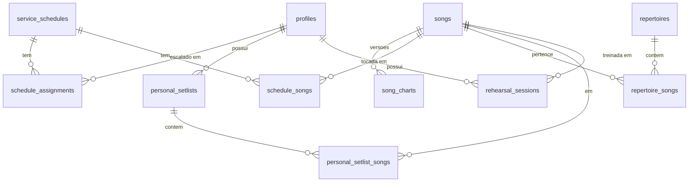

# Uníssono — Esquema de dados

> Fase 2 · Postgres 17 (Supabase) · RLS habilitada em **todas** as tabelas.
> As migrações versionadas estão em [`supabase/migrations`](../supabase/migrations) e foram
> aplicadas no projeto de desenvolvimento `unissono` (região `sa-east-1`).

## 1. Visão geral



## 2. Tipos próprios

| Tipo                     | Definição                                      | Onde é usado                                                 |
| ------------------------ | ---------------------------------------------- | ------------------------------------------------------------ |
| `public.user_role`       | enum `lider`, `musico`                         | `profiles.role`                                              |
| `public.schedule_status` | enum `rascunho`, `publicada`, `cancelada`      | `service_schedules.status`                                   |
| `public.musical_key`     | domínio sobre `text`, regex `^[A-G](#\|b)?m?$` | `songs.default_key`, `song_charts.key`, `schedule_songs.key` |

O domínio de tom aceita `C`, `F#`, `Bb`, `Am`, `Ebm` e recusa `H`, `X#`, `Gbb`. A validação
fica no banco porque a transposição do app depende dela.

## 3. Tabelas

### `profiles`

Membro do ministério. **`id` é o próprio `auth.users.id`** — não existe coluna `auth_user_id`,
o que deixa toda política de RLS na forma `id = auth.uid()`, sem junção.

| Coluna                      | Tipo        | Regras                                                   |
| --------------------------- | ----------- | -------------------------------------------------------- |
| `id`                        | uuid PK     | FK → `auth.users(id)`, `on delete cascade`               |
| `name`                      | text        | 2–120 caracteres (após `btrim`)                          |
| `role`                      | `user_role` | padrão `musico`; só líder altera (trigger)               |
| `instrument`                | text        | 2–60 caracteres, opcional                                |
| `avatar_url`                | text        | precisa começar com `https://`                           |
| `is_active`                 | boolean     | padrão `true`; desativar preserva o histórico de escalas |
| `created_at` / `updated_at` | timestamptz | `updated_at` por trigger                                 |

### `songs`

| Coluna        | Tipo            | Regras                                                                      |
| ------------- | --------------- | --------------------------------------------------------------------------- |
| `id`          | uuid PK         | `gen_random_uuid()`                                                         |
| `title`       | text            | 1–200 caracteres                                                            |
| `artist`      | text            | opcional                                                                    |
| `default_key` | `musical_key`   | tom original                                                                |
| `bpm`         | smallint        | 20–300                                                                      |
| `tags`        | text[]          | padrão `{}`, índice GIN                                                     |
| `youtube_url` | text            | precisa ser URL de vídeo do YouTube com id de 11 caracteres                 |
| `created_by`  | uuid            | FK → `profiles`, `on delete set null`                                       |
| `search_text` | text **gerado** | `immutable_unaccent(lower(title \|\| ' ' \|\| artist))`, índice GIN trigram |

A busca ignora acentos e maiúsculas sem varrer a tabela: "coracao" encontra "Coração".

### `song_charts`

Cifras em ChordPro, versionadas. `unique (song_id, version)` e a versão é atribuída por
trigger (`max(version) + 1`), então dois líderes salvando ao mesmo tempo não colidem.
Editar uma cifra **cria uma versão nova**; nenhuma versão é sobrescrita.

### `service_schedules`, `schedule_songs`, `schedule_assignments`

`service_schedules` tem `unique (date, service_type)`. As músicas do culto ficam em
`schedule_songs` — tabela separada das atribuições (ADR-004): com `song_id` dentro de
`schedule_assignments`, a lista de músicas se repetiria para cada músico escalado.

`schedule_songs.key` nulo significa "usar `songs.default_key`". A ordem usa a coluna
`position` (`order` é palavra reservada em SQL), com unique **deferrable** por escala —
reordenar a lista inteira numa transação passa por estados temporariamente duplicados.

### `repertoires` / `repertoire_songs`

Agrupamento temático reutilizável entre escalas. Mesma estratégia de `position` deferrable.

### `personal_setlists` / `personal_setlist_songs`

Listas de estudo do músico. Privadas — ver §5.

### `rehearsal_sessions`

Uma linha por músico e música (`unique (song_id, profile_id)`), com `notes`,
`loop_start`, `loop_end` (segundos) e `playback_speed`. O banco recusa
`playback_speed` fora de 0,25–2 (limite do player do YouTube) e loop invertido
(`loop_start < loop_end`).

## 4. Funções e gatilhos

| Objeto                               | Papel                                                                                                                                            |
| ------------------------------------ | ------------------------------------------------------------------------------------------------------------------------------------------------ |
| `set_updated_at()`                   | mantém `updated_at` em todas as tabelas que têm a coluna                                                                                         |
| `immutable_unaccent(text)`           | envelopa `unaccent` como IMMUTABLE para permitir índice de expressão                                                                             |
| `is_leader()` / `is_active_member()` | `security definer`; leem `profiles` ignorando a RLS da própria tabela e evitam recursão de política                                              |
| `handle_new_user()`                  | cria o perfil quando nasce um usuário no Auth. **O papel nunca vem dos metadados do cadastro** — senão qualquer pessoa se cadastraria como líder |
| `enforce_profile_privilege_guard()`  | recusa mudança de `role`/`is_active` por quem não é líder e impede o ministério ficar sem líder ativo                                            |
| `set_song_chart_version()`           | numera a versão da cifra                                                                                                                         |

### Bootstrap do primeiro líder

Sem usuário autenticado (`auth.uid() is null`) o guarda libera a alteração: é o caminho do
`service_role`, das migrações e do seed. É assim que o primeiro líder é criado. O papel
`anon` não alcança esse trigger porque não tem política de UPDATE em `profiles`.

## 5. Matriz de permissões (RLS)

| Tabela                                        | SELECT                                            | INSERT / UPDATE / DELETE                                               |
| --------------------------------------------- | ------------------------------------------------- | ---------------------------------------------------------------------- |
| `profiles`                                    | membro ativo (e sempre o próprio perfil)          | próprio perfil **ou** líder; `role`/`is_active` só por líder (trigger) |
| `songs`, `song_charts`                        | membro ativo                                      | líder                                                                  |
| `repertoires`, `repertoire_songs`             | membro ativo                                      | líder                                                                  |
| `service_schedules`                           | líder: todas · músico: apenas `publicada`         | líder                                                                  |
| `schedule_songs`, `schedule_assignments`      | líder: todas · músico: apenas de escala publicada | líder                                                                  |
| `personal_setlists`, `personal_setlist_songs` | **somente o dono**                                | somente o dono                                                         |
| `rehearsal_sessions`                          | **somente o dono**                                | somente o dono                                                         |

O papel `anon` teve os privilégios revogados em todas as tabelas: sem sessão, não há leitura.
Setlists e anotações de treino são invisíveis inclusive para o líder (DP-06) — e há teste
automatizado provando isso.

Cada tabela tem **uma única** política de SELECT (o advisor de performance do Supabase
aponta políticas permissivas sobrepostas, porque o Postgres avalia todas em cada consulta);
as permissões de escrita do líder estão em políticas separadas por operação.

## 6. Realtime

`service_schedules`, `schedule_songs` e `schedule_assignments` estão na publicação
`supabase_realtime`. O evento só invalida o cache do cliente — a leitura seguinte continua
passando pela RLS.

## 7. Testes

[`tests/integration/rls`](../tests/integration/rls) autentica de verdade como líder,
músico 1 e músico 2 (sem chave administrativa) e verifica cada linha da matriz acima,
incluindo as tentativas que **devem** falhar: escalada de privilégio, leitura de rascunho
por músico, escrita no catálogo por músico, acesso a dados pessoais alheios.

```bash
npm run test:rls   # exige .env com as credenciais do projeto Supabase
```

## 8. Dados de desenvolvimento

[`supabase/seed.sql`](../supabase/seed.sql) cria três contas de teste
(`lider@`, `musico1@`, `musico2@unissono.test`), músicas, uma escala publicada e uma em
rascunho. **Somente para o projeto de desenvolvimento**: as senhas são conhecidas e o
arquivo é versionado em repositório público.

## 9. Pendências desta fase

- Storage de avatares (bucket + políticas) — quando a edição de perfil existir (Fase 3).
- Convite de membro por e-mail exige `service_role` e, portanto, uma Edge Function (Fase 3).
- Tipos TypeScript gerados a partir do banco (`database.types.ts`) entram na Fase 3, junto
  com a camada de dados que vai consumi-los.
