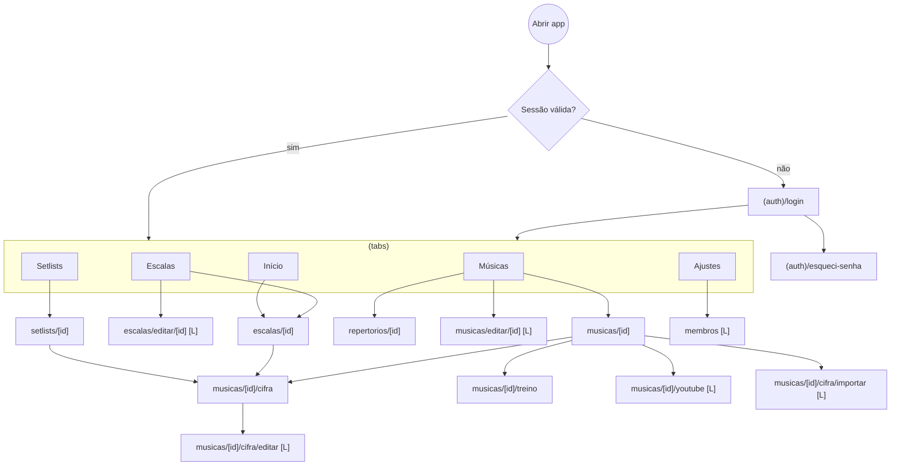

# Uníssono — Wireframes textuais

> Status: **rascunho para aprovação (Fase 0)** · Navegação com **5 abas** (DP-09). Elementos marcados com `[L]` aparecem só para líder.

## 1. Mapa de navegação



Mapeamento para o `<directory_structure>` original: `cifras` e `treino` deixam de ser abas e viram rotas de pilha a partir de uma música; `repertorio` passa a se chamar **Músicas** (catálogo + repertórios); `configuracoes` passa a se chamar **Ajustes**.

---

## 2. Login — `(auth)/login` · US-01, US-02

```
┌─────────────────────────────────┐
│                                 │
│            ♪ Uníssono           │
│     Ministério de Louvor        │
│                                 │
│  E-mail                         │
│  ┌───────────────────────────┐  │
│  │ nome@igreja.com           │  │
│  └───────────────────────────┘  │
│  Senha                          │
│  ┌───────────────────────┬───┐  │
│  │ ••••••••              │ 👁 │  │
│  └───────────────────────┴───┘  │
│                                 │
│  ┌───────────────────────────┐  │
│  │          Entrar           │  │
│  └───────────────────────────┘  │
│        Esqueci minha senha      │
│                                 │
│  Acesso somente por convite do  │
│  líder do ministério.           │
└─────────────────────────────────┘
Estados: carregando (botão com spinner, campos bloqueados) ·
erro "E-mail ou senha inválidos" · sem conexão (banner).
```

## 3. Início — `(tabs)/home` · US-14

```
┌─────────────────────────────────┐
│ Olá, Ana                   ⚙︎   │
├─────────────────────────────────┤
│ PRÓXIMA ESCALA                  │
│ ┌─────────────────────────────┐ │
│ │ Dom, 20 set · Culto 19h     │ │
│ │ Você: Violão                │ │
│ │ 5 músicas                   │ │
│ │ [ Ver escala ]  [ Cifras ]  │ │
│ └─────────────────────────────┘ │
│                                 │
│ DEPOIS                          │
│ ▸ Qua, 23 set · Ensaio · Violão │
│ ▸ Dom, 27 set · Culto 10h · Voz │
│                                 │
│ CONTINUAR TREINANDO             │
│ ▸ Música A   (loop 1:12–1:40)   │
│ ▸ Música B                      │
│                                 │
│ [L] RASCUNHOS                   │
│ ▸ Dom, 04 out · 2 vagas abertas │
├─────────────────────────────────┤
│ 🏠Início 📅Escalas 🎵Músicas ☰Setlists ⚙︎Ajustes │
└─────────────────────────────────┘
Vazio: "Você não está escalado(a) nos próximos cultos."
```

## 4. Escalas — `(tabs)/escalas` · US-13, US-14

```
┌─────────────────────────────────┐
│ Escalas                   [L] ＋ │
├─────────────────────────────────┤
│ ( Próximas ) ( Minhas ) ( Passadas ) │
│ [L] ( Rascunhos )               │
├─────────────────────────────────┤
│ SETEMBRO                        │
│ ┌─────────────────────────────┐ │
│ │ Dom 20 · Culto 19h  PUBLICADA│ │
│ │ 6 músicos · 5 músicas       │ │
│ │ ● você está escalado(a)     │ │
│ └─────────────────────────────┘ │
│ ┌─────────────────────────────┐ │
│ │ Qua 23 · Ensaio    PUBLICADA│ │
│ └─────────────────────────────┘ │
│ [L]┌───────────────────────────┐│
│    │ Dom 27 · Culto 10h RASCUNHO││
│    └───────────────────────────┘│
└─────────────────────────────────┘
FlatList agrupada por mês · pull-to-refresh · atualização Realtime.
```

## 5. Detalhe da escala — `escalas/[id]` · US-15

```
┌─────────────────────────────────┐
│ ←  Dom, 20 set · Culto 19h  [L]✎│
├─────────────────────────────────┤
│ EQUIPE                          │
│  Ministração ...... Pessoa 1    │
│  Voz .............. Pessoa 2    │
│  Violão ........... Você        │
│  Teclado .......... Pessoa 3    │
│  Baixo ............ Pessoa 4    │
│  Bateria .......... Pessoa 5    │
│                                 │
│ MÚSICAS                         │
│  1. Música A        Tom: G   ▶︎ │
│  2. Música B        Tom: D   ▶︎ │
│  3. Música C        Tom: B♭  ▶︎ │
│                                 │
│ ┌─────────────────────────────┐ │
│ │  Abrir cifras em sequência  │ │
│ └─────────────────────────────┘ │
└─────────────────────────────────┘
Tocar em uma música abre a cifra já transposta para o tom do culto,
com navegação ◀︎ ▶︎ para a próxima música da escala.
```

## 6. Editor de escala `[L]` — `escalas/editar/[id]` · US-10–US-13

```
┌─────────────────────────────────┐
│ ✕  Nova escala           Salvar │
├─────────────────────────────────┤
│ Data         [ 27/09/2026  📅 ] │
│ Tipo         [ Culto 10h     ▾] │
│                                 │
│ EQUIPE                  ＋ Função│
│ ┌─────────────────────────────┐ │
│ │ Violão   [ Selecionar... ▾]✕│ │
│ │ Voz      [ Pessoa 2      ▾]✕│ │
│ └─────────────────────────────┘ │
│ ⚠ Pessoa 2 já está em "Voz" e   │
│   "Teclado" neste culto.        │
│                                 │
│ MÚSICAS               ＋ Adicionar│
│ ≡ 1. Música A   Tom [ G ▾]    ✕ │
│ ≡ 2. Música B   Tom [ D ▾]    ✕ │
│                                 │
│ Status: Rascunho                │
│ ┌─────────────────────────────┐ │
│ │        Publicar escala      │ │
│ └─────────────────────────────┘ │
└─────────────────────────────────┘
≡ = arrastar para reordenar · validação Zod antes de salvar ·
confirmação ao sair com alterações não salvas.
```

## 7. Músicas — `(tabs)/repertorio` · US-23, US-41, US-42

```
┌─────────────────────────────────┐
│ Músicas                   [L] ＋ │
├─────────────────────────────────┤
│ ┌───────────────────────────┐   │
│ │ 🔍 Buscar título, artista, trecho │
│ └───────────────────────────┘   │
│ ( Catálogo ) ( Repertórios )    │
│ Filtros: [Tag ▾] [Tom ▾] [Artista ▾] │
├─────────────────────────────────┤
│ Música A                        │
│ Artista X · G · 72 bpm  #adoração│
│─────────────────────────────────│
│ Música B                        │
│ Artista Y · D · 128 bpm #celebração│
│─────────────────────────────────│
│ ...                             │
└─────────────────────────────────┘
Aba "Repertórios": lista de repertórios (nome, nº de músicas) →
repertorios/[id] com a lista ordenável [L].
```

## 8. Detalhe da música — `musicas/[id]` · US-30, US-40

```
┌─────────────────────────────────┐
│ ←  Música A                 [L]✎│
├─────────────────────────────────┤
│ Artista X                       │
│ Tom original: G · 72 bpm        │
│ #adoração #ceia                 │
│                                 │
│ ┌─────────────────────────────┐ │
│ │      ▶︎  miniatura vídeo     │ │
│ └─────────────────────────────┘ │
│ [L] Trocar vídeo                │
│                                 │
│ ┌──────────┐┌──────────┐┌──────┐│
│ │ 🎼 Cifra ││ 🎧 Treinar││ ＋ Setlist││
│ └──────────┘└──────────┘└──────┘│
│                                 │
│ CIFRA · versão 3 (12/09/2026)   │
│ [L] Importar nova · Histórico   │
│                                 │
│ REPERTÓRIOS: Ceia, Domingos     │
└─────────────────────────────────┘
Sem vídeo: [L] "Buscar no YouTube" · músico vê "Sem vídeo vinculado".
Sem cifra: [L] "Importar cifra" · músico vê estado vazio.
```

## 9. Visualizador de cifra — `musicas/[id]/cifra` · US-20–US-22, US-27, US-28

```
┌─────────────────────────────────┐
│ ←  Música A          ◀︎ 2/5 ▶︎   │
├─────────────────────────────────┤
│ Tom: [−] G → A [+]  #/♭  A− A+  │
│ [ Só letra ]                    │
├─────────────────────────────────┤
│ [Verso 1]                       │
│ A            E/G#               │
│ Primeira linha da letra aqui    │
│ F#m          D                  │
│ Segunda linha da letra aqui     │
│                                 │
│ [Refrão]                        │
│ D        A       E              │
│ Linha do refrão                 │
│ ...                             │
├─────────────────────────────────┤
│  ⏸  Rolagem   [ − ] 1,0× [ + ]  │
│  ▓▓▓▓▓▓▓░░░░░░░░  1:24 / 4:10   │
└─────────────────────────────────┘
Barra superior some ao rolar e volta com toque · tela não apaga
durante a rolagem · ◀︎ ▶︎ só aparece quando aberta a partir de escala/setlist.
Texto de letra acima é ilustrativo (placeholder), não conteúdo real.
```

## 10. Importar/editar cifra `[L]` — `musicas/[id]/cifra/importar` e `/editar` · US-24–US-26

```
┌─────────────────────────────────┐
│ ✕  Importar cifra     Continuar │
├─────────────────────────────────┤
│ ( Colar texto ) ( Arquivo .txt/.cho ) │
│ ┌─────────────────────────────┐ │
│ │ G          D/F#             │ │
│ │ Linha de letra colada       │ │
│ │ Em         C                │ │
│ │ ...                         │ │
│ └─────────────────────────────┘ │
│ Formato detectado:              │
│ (●) Acordes sobre letra         │
│ ( ) ChordPro                    │
│ Tom da cifra  [ G ▾]            │
│                                 │
│ ⓘ Importe apenas conteúdo que o │
│   ministério tem direito de usar.│
└─────────────────────────────────┘
          │ Continuar
          ▼
┌─────────────────────────────────┐
│ ←  Pré-visualização      Salvar │
├─────────────────────────────────┤
│ (renderização igual ao §9)      │
│ ⚠ Linha 14: "Hx" não reconhecido│
│   como acorde — mantido como texto│
│ Salvará como versão 4           │
└─────────────────────────────────┘
Editor: campo ChordPro monoespaçado + alternância "Editar / Visualizar".
```

## 11. Busca no YouTube `[L]` — `musicas/[id]/youtube` · US-30

```
┌─────────────────────────────────┐
│ ←  Vincular vídeo               │
├─────────────────────────────────┤
│ ┌───────────────────────────┐   │
│ │ 🔍 Música A Artista X        │ │
│ └───────────────────────────┘   │
├─────────────────────────────────┤
│ ┌──────┐ Título do vídeo        │
│ │ ▶︎    │ Canal · 4:10          │
│ └──────┘         [ Pré-ver ]    │
│ ┌──────┐ Título do vídeo 2      │
│ │ ▶︎    │ Canal · 5:02          │
│ └──────┘         [ Pré-ver ]    │
│ ...            Carregar mais    │
├─────────────────────────────────┤
│ ┌─────────────────────────────┐ │
│ │    Vincular vídeo selecionado│ │
│ └─────────────────────────────┘ │
└─────────────────────────────────┘
Busca pré-preenchida com "título + artista" · debounce 500 ms ·
erro de cota: "Limite diário de buscas atingido. Tente amanhã."
```

## 12. Treino — `musicas/[id]/treino` · US-50–US-53

```
┌─────────────────────────────────┐
│ ←  Treino · Música A            │
├─────────────────────────────────┤
│ ┌─────────────────────────────┐ │
│ │    [ player YouTube 16:9 ]  │ │
│ └─────────────────────────────┘ │
│ 1:15 ━━━━━━●━━━━━━━━━━━━ 4:10   │
│        A▲1:12      B▲1:40       │
│ [ Marcar A ] [ Marcar B ] [ 🔁 Loop ON ] │
│ Velocidade: (0,5) (0,75) (●1×) (1,25) │
├─────────────────────────────────┤
│ ( Cifra ) ( Anotações )         │
│ ┌─────────────────────────────┐ │
│ │ Anotações pessoais          │ │
│ │ Entrada: 2 compassos só     │ │
│ │ baixo; ponte sobe meio tom. │ │
│ └─────────────────────────────┘ │
│ Salvo automaticamente ✓         │
└─────────────────────────────────┘
Sem vídeo vinculado: apenas cifra + anotações e aviso.
Loop e velocidade são restaurados da última sessão (rehearsal_sessions).
```

## 13. Setlists — `(tabs)/setlists` e `setlists/[id]` · US-60, US-61

```
┌─────────────────────────────────┐   ┌─────────────────────────────────┐
│ Minhas setlists             ＋   │   │ ←  Estudo de setembro      ⋯    │
├─────────────────────────────────┤   ├─────────────────────────────────┤
│ Estudo de setembro   · 6 músicas│   │ ≡ 1. Música A      G     ▶︎ ✕  │
│ Músicas novas        · 3 músicas│   │ ≡ 2. Música B      D     ▶︎ ✕  │
│ Aquecimento          · 4 músicas│   │ ≡ 3. Música C      B♭    ▶︎ ✕  │
│                                 │   │                                 │
│ ⓘ Visíveis apenas para você.    │   │ ＋ Adicionar músicas            │
└─────────────────────────────────┘   │ [ Abrir cifras em sequência ]   │
                                      └─────────────────────────────────┘
⋯ = renomear / excluir (com confirmação) · deslizar item para remover.
```

## 14. Ajustes — `(tabs)/configuracoes` · US-70, US-04

```
┌─────────────────────────────────┐
│ Ajustes                         │
├─────────────────────────────────┤
│ PERFIL                          │
│ (foto) Ana · Violão     Editar ›│
│                                 │
│ APARÊNCIA                       │
│ Tema   ( Claro ) ( Escuro ) (●Sistema) │
│                                 │
│ LEITURA DE CIFRA                │
│ Tamanho padrão da fonte  [ 18 ▾]│
│ Acidentes  (●Pelo tom) (#) (♭)  │
│                                 │
│ [L] MINISTÉRIO                  │
│ Membros e papéis              › │
│ Convidar membro               › │
│                                 │
│ Sobre · Termos · Privacidade    │
│ ┌─────────────────────────────┐ │
│ │            Sair             │ │
│ └─────────────────────────────┘ │
└─────────────────────────────────┘
```

## 15. Estados transversais

| Estado                 | Padrão visual                                                           |
| ---------------------- | ----------------------------------------------------------------------- |
| Carregando lista       | Skeletons de 3–5 linhas (sem spinner de tela cheia)                     |
| Vazio                  | Ícone + frase + ação primária quando o papel permite                    |
| Erro de rede           | Banner fixo "Sem conexão — exibindo dados salvos" + tentar novamente    |
| Proibido (403/RLS)     | "Você não tem permissão para esta ação" e retorno à tela anterior       |
| Confirmação destrutiva | Modal com o nome do item e botão vermelho explícito ("Excluir setlist") |
